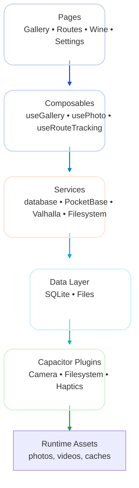

# dietl.mobi — App Architecture Landing Page

## Mission
- A mobile-first gallery, route, wine, and books companion built with Ionic/Vue that stays usable offline yet syncs with PocketBase and Valhalla when needed.

## Quick Facts
- **UI Framework:** Ionic 8 components + Vue 3 `<script setup>` (Composition API) styled via `src/global.css`, `src/theme`, and Ionic palettes (default, wine, forest, ocean).
- **Build & Platform:** Vite 5 + Capacitor 8 delivers web builds (`npm run dev`, `npm run build`) and native Android shells driven by `npx cap sync`/`run`.
- **State & Storage:** Local SQLite (`@capacitor-community/sqlite`) keeps galleries, photos, wines, routes, and books grouped, while Capacitor filesystem stores actual asset files under `Directory.Data/galleries/{galleryId}`.
- **Localization:** vue-i18n files (`src/i18n/{en,de,fr,it,bar}.ts`) expose nested keys for settings placeholders, toast texts, storage labels, and auto-generated strings so UI copy can switch languages at runtime.

## Functional Outline
1. **Gallery/Lightbox:** EXIF-aware photo upload, manual GPS input (`usePhoto.ts`), modal-based editors, region-based filtering, timeline entry linking, plus the `GalleryMap` component showing geo pins.
2. **Route Tracking:** Live GPS logging, Valhalla validation, modal waypoint editing, timeline visualization, and route-detail map overlays with popup actions (`RoutesPage.vue`, `RouteDetailPage.vue`).
3. **Wine Cellar:** SQLite models enriched with metadata and photos; `useWine.ts` handles CRUD; pages expose an editable list, detail view, and photo attachment toolbelt.
4. **Books & Productivity:** ISBN scanning for books, PocketBase sync via `usePocketbaseSync.ts`, plus todo/shopping list helpers that surface category management and notifications.
5. **Settings & Sync:** Local options for PocketBase credentials, Valhalla endpoints, storage choice, theme selection, and language toggles mirrored by translation keys (see `src/i18n/en.ts` settings entries).

## Backend Systems & Product Links
- **PocketBase (https://pocketbase.io/):** Cloud sync target for books, todos, and shopping list states. Credentials stored in settings pages feed `usePocketbaseSync.ts`, which manages sessions, tokens, and toast notifications if sync fails or succeeds.
- **Valhalla (https://valhalla.github.io/):** Route validation engine (minimum three GPS points) invoked from `useRouteTracking.ts`. Validated track shapes and confirmations appear in route detail popups, and failure codes trigger user feedback to revisit GPS coverage.
- **Local SQLite:** `src/services/database.ts` initializes tables for `galleries`, `photos`, `wines`, `routes`, `books`, etc. Everything routes through the `db` singleton to keep the UI reactive while offline operations continue.

## Module Diagrams
### High-Level Flow

### Module Breakdown

```mermaid
flowchart LR
  subgraph Pages
    GalleryPage(GalleryPage)
    RoutesPage(RoutesPage)
    WinePage(WinePage)
    SettingsPage(SettingsPage)
    BookDetailPage(BookDetailPage)
  end
  subgraph Composables
    useGallery(useGallery)
    usePhoto(usePhoto)
    useRouteTracking(useRouteTracking)
    usePocketbaseSync(usePocketbaseSync)
    useTimeline(useTimeline)
    useLightbox(useLightbox)
  end
  subgraph Services
    database(database.ts)
    exif(exif.ts)
    storage(storage helpers)
  end
  subgraph Backends
    PocketBaseAPI(PocketBase API)
    ValhallaAPI(Valhalla API)
  end
  subgraph DataStores
    SQLite(SQLite tables)
    Filesystem(Filesystem assets)
  end
  subgraph Capacitor
    Camera(Camera plugin)
    FilesystemPlugin(Filesystem plugin)
    Haptics(Haptics)
  end
  Pages --> useGallery
  Pages --> usePhoto
  Pages --> useRouteTracking
  Composables --> Services
  Services --> SQLite
  Services --> Filesystem
  Services --> PocketBaseAPI
  Services --> ValhallaAPI
  SQLite --> Capacitor
  Filesystem --> Capacitor
  Capacitor --> Assets[Assets<br/>photos • videos]
  class GalleryPage,RoutesPage,WinePage,SettingsPage,BookDetailPage pagesStyle
  class useGallery,usePhoto,useRouteTracking,usePocketbaseSync,useTimeline,useLightbox compsStyle
  class database,exif,storage servicesStyle
  class PocketBaseAPI,ValhallaAPI backendStyle
  class SQLite,Filesystem storeStyle
  class Capacitor capStyle
  classDef pagesStyle fill:#ffffff,stroke:#e7e5ff,stroke-width:2px,rx:10,ry:10,fill-opacity:0.5
  classDef compsStyle fill:#ffffff,stroke:#dce6ff,stroke-width:2px,rx:10,ry:10,fill-opacity:0.5
  classDef servicesStyle fill:#ffffff,stroke:#ffe4d6,stroke-width:2px,rx:10,ry:10,fill-opacity:0.5
  classDef backendStyle fill:#ffffff,stroke:#def7ec,stroke-width:2px,rx:10,ry:10,fill-opacity:0.5
  classDef storeStyle fill:#ffffff,stroke:#dbeafe,stroke-width:2px,rx:10,ry:10,fill-opacity:0.5
  classDef capStyle fill:#ffffff,stroke:#d1fae5,stroke-width:2px,rx:10,ry:10,fill-opacity:0.5
  linkStyle 0 stroke:#a855f7,stroke-dasharray:5 5
  linkStyle 1 stroke:#4338ca,stroke-width:2px
  linkStyle 2 stroke:#ea580c,stroke-width:2px,stroke-dasharray:2 4
  linkStyle 3 stroke:#10b981,stroke-width:2px
  linkStyle 4 stroke:#0ea5e9,stroke-width:2px
  linkStyle 5 stroke:#16a34a,stroke-width:2px
  style GalleryPage rx:18,ry:18,width:160px,height:100px,fill-opacity:0.4
  style RoutesPage rx:18,ry:18,width:160px,height:100px,fill-opacity:0.4
  style WinePage rx:18,ry:18,width:160px,height:100px,fill-opacity:0.4
  style SettingsPage rx:18,ry:18,width:160px,height:100px,fill-opacity:0.4
  style BookDetailPage rx:18,ry:18,width:160px,height:100px,fill-opacity:0.4
  style useGallery rx:12,ry:12,width:140px,height:80px,fill-opacity:0.35
  style usePhoto rx:12,ry:12,width:140px,height:80px,fill-opacity:0.35
  style useRouteTracking rx:12,ry:12,width:140px,height:80px,fill-opacity:0.35
  style usePocketbaseSync rx:12,ry:12,width:140px,height:80px,fill-opacity:0.35
  style useTimeline rx:12,ry:12,width:140px,height:80px,fill-opacity:0.35
  style useLightbox rx:12,ry:12,width:140px,height:80px,fill-opacity:0.35
  style database rx:12,ry:12,width:140px,height:80px,fill-opacity:0.35
  style exif rx:12,ry:12,width:140px,height:80px,fill-opacity:0.35
  style storage rx:12,ry:12,width:140px,height:80px,fill-opacity:0.35
  style PocketBaseAPI rx:12,ry:12,width:140px,height:80px,fill-opacity:0.35
  style ValhallaAPI rx:12,ry:12,width:140px,height:80px,fill-opacity:0.35
  style SQLite rx:12,ry:12,width:140px,height:80px,fill-opacity:0.35
  style Filesystem rx:12,ry:12,width:140px,height:80px,fill-opacity:0.35
  style Capacitor rx:12,ry:12,width:140px,height:80px,fill-opacity:0.35
```

## README Landing Vibes
- Designed as a quick reference for maintainers: summary bullet lists, backend links, and Mermaid diagrams allow future devs to orient themselves before diving into `src/`.
- The documentation folder now hosts both this README and `app-overview.md`—feel free to link between them when presenting to stakeholders or new engineers.

Need more detail for any module (e.g., `usePhoto.ts` internals or PocketBase request lifecycle)? Just ask and I can keep expanding this page.